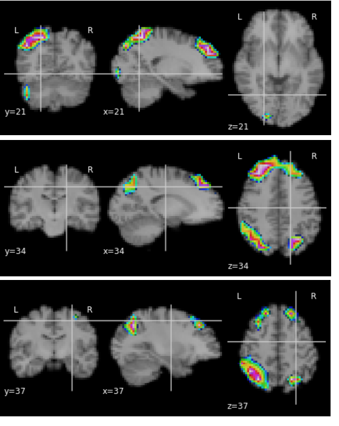
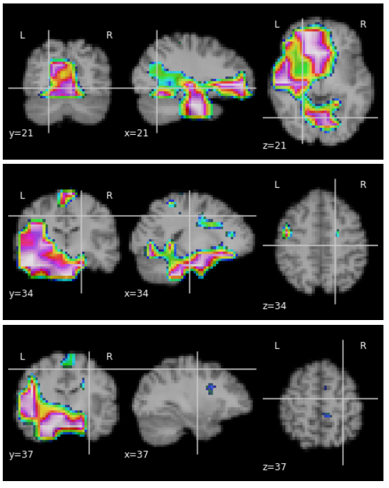

# Interpretable Deep Learning for Pattern Recognition in Brain Differences Between Men and Women

### 5 Nearest_Neighbors_team

We analyze data provided by The Human Connectome Project (HCP).  Using diffusion MRI data we solve the problem of binary classification of finding the sex of an person using 3D-CNN. Further we intepret obtained model to undestand of male-female brain differencies. 

## Setup and Dependencies

- python

- numpy

- pytorch 

- nilearn

## DATABASE 

The data we use is an open-access database taken from Human Connection Project (HCP). We worked with tabular description of MPI data  and DTI preprocessed MRI data(maps of factional anisotropy(FA tensor) as a result). 

Data contain 1113 subjects, including 507 men and 606 women, age varies from 22 to 36.Each object is represented by a 1 GB ZIP archive with a name corresponding to a unique object ID.Each archive contains a lot of different information. For automatic access to the target MRI file, the power shell script was written that can be found in DATE_ACCESS.md. The script allows you to extract the necessary file from the internal ZIP archive(inside the main archive), without unzipping the main one to save time. Also, a unique ID corresponding to each object is assigned as a name for each file.

### Tabular

#### tabular_data.ipynb — processing with tabular data
#### unrestricted_hcp_freesurfer.csv —  tabular data
#### xgb_importance.csv - feature importances of XGB 
#### log_reg_importance.csv - feature importances of logistic regression

### 2D CNN
#### 2d_model_cv .ipynb — complete evaluation pipeline for the 2d model

### 3D CNN
#### mri_data_processing.ipynb - translate data into numpy arrays, ID sync, dimensional reduction
#### mri_model.py - file with 3D CNN model
#### training_model.ipynb - training process

### Feature analysis
#### feature_analysis.ipynb - first layer feature analysis

### Meaningful perturbation
#### MASK_new.ipynb - meaningful perturbation process  

## CNN Model

## Meaningful perturbation
[3D visualization of brain](https://maxs-kan.github.io/Brain_Differences_project_ML2020/brain.html)
[3D visualization of mask](https://maxs-kan.github.io/Brain_Differences_project_ML2020/mask.html)
## Man

## Woman

